# Lab 1A
{: .fs-9 }

# Prelab
{: .fs-5 }
For setting my computer and arduino for Lab 1A, I first needed to install the Arduino IDE in order to connect to the Artermis Nano Redboard and burn code into it.

# Blink
{: .fs-3 }
The first example that I needed to run on the Arduino was Blink. In order for the Blink program to properly work with the Arduino, I needed to lower the baud rate which has to do with the rate that information is transferred.

# Serial
{: .fs-3 }
After this I ran the Serial example, which demonstrates writing messages to the serial monitor in the Arduino IDE and it reprinting it down. 

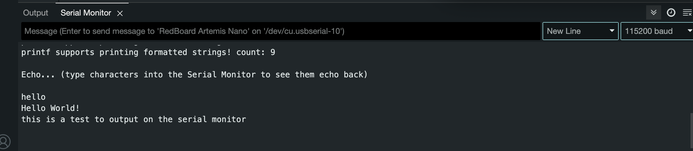

# Temperature
{: .fs-3 }
Following this example, I went on to the next one, which was analogRead. This example file had to do with demonstrating the temperature sensor and repeatedly printing it out in the serial monitor. 

# Microphone
{: .fs-3 }
The final example is the MicrophoneOutput. In the following video, you'll hear me snapping my fingers, which will cause the sensor frequency values in the serial monitor to fluctuate accordingly. 

# Lab 1B
{: .fs-9 }

# Prelab
{: .fs-5 }
Lab1B required significantly more setup as opposed to Lab1A which just required installing the Arduino IDE. For the prelab for Lab1B, we needed to first make sure we had python installed as well as the venv functionality for python installed as well. This allows us to create environments to install libraries and packages isolated from other environments. We then installed the necessary packages (most importantly Jupyter Lab!) and activated the environment. After setting up Jupyter and installing the BLE library for the Arduino IDE, I needed to configure it to make sure that my laptop was able to wirelessly connect over Bluetooth to my Arduino.

We first needed to find the MAC Address, which we found through the Arduino IDE as shown in the following image:
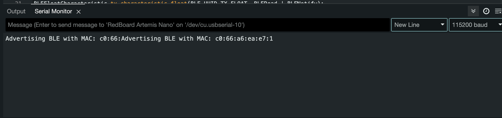

I then needed to change my BLEService UUID from the default in the Jupyter notebooks.

Firstly in ble_arduino.ino:
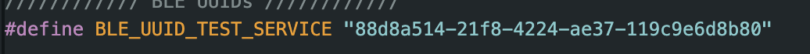

Then in connections.yaml:

After that I double checked that the commands lined up between the Arduino IDE and the Jupyter notebook. 

After finishing setting up the rest of the notebook, I was able to connect my laptop to the Arduino as shown:
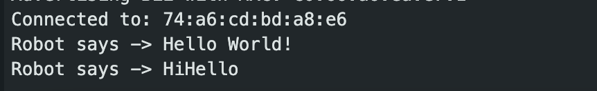

A brief explanation on the codebase and how we use Bluetooth in this lab is as follows: The Bluetooth connection is handled by the given ble_arduino.ino file and is sustained with our computer through the Jupyter notebook. To be able to send instructions to the Arduino from my laptop, we use the RobotCommands. In order to send data in the reverse direction, we need to first generate UUIDs for the types of data used by the Arduino, then use the BLE Service that we add the BLE Characteristics to; these are constructors for handling different types of data in the Arduino. Below is an example of how I both sent and received data from my laptop to the Arduino from Jupyter Lab with the command PING.
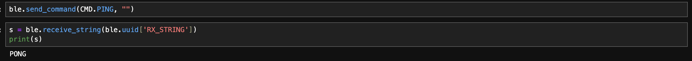

# Tasks
{: .fs-5 }

# Task 1
{: .fs-3 }
The first task involved creating a new command "ECHO" and having it print the received string into the Jupyter Notebook.

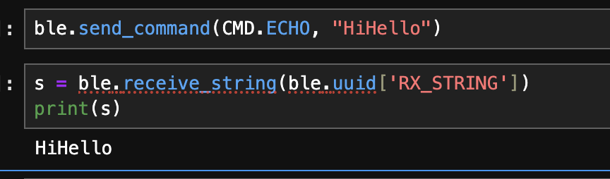

The code for the command involved appending the string sent in the command directly to the String Characteristic and then printing the output to the Serial Monitor.

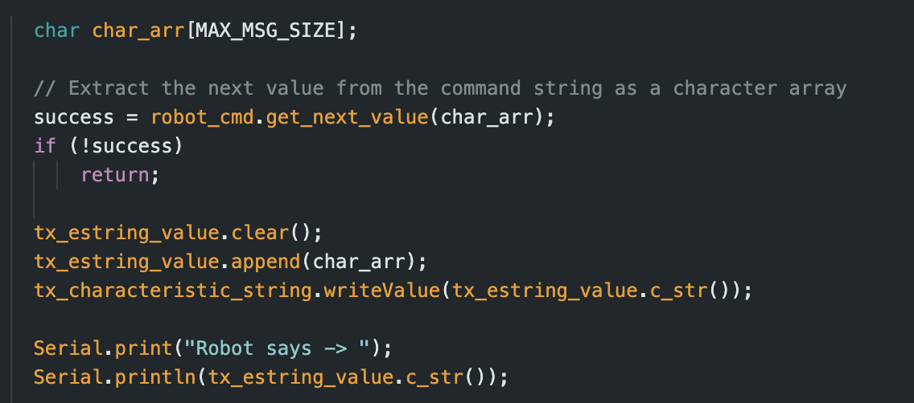

# Task 2
{: .fs-3 }
The second task was to create the command "SEND_THREE_FLOATS", which was for the laptop to send 3 floats to the Arduino and to print these values in the Serial Monitor.

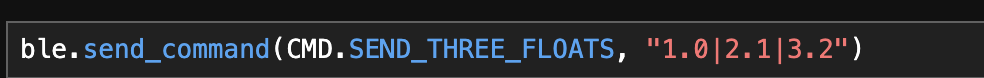
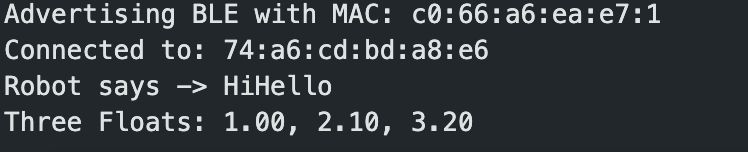

The code for this command involved getting the three command values one by one and also printing it one by one.

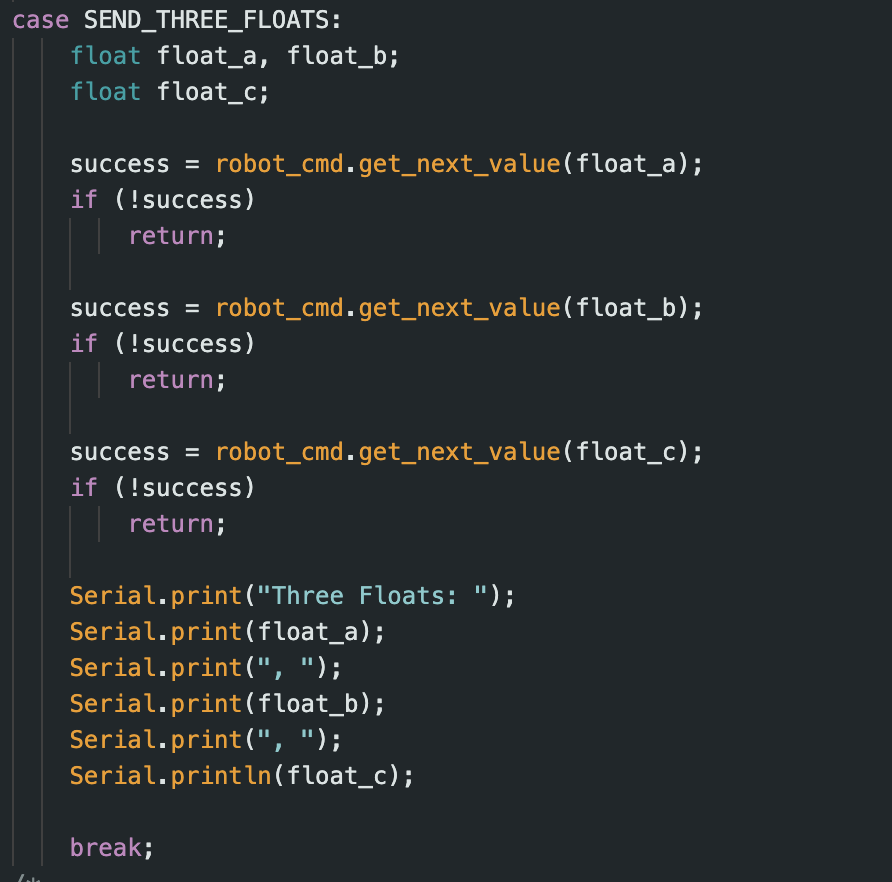

# Task 3
{: .fs-3 }

The next task was to create the command "GET_TIME_MILLIS" and for this command we needed the Arduino to send back a timestamp of the current time in millisecnonds from booting up in the format "T:123456".

The code for this command involved using the millis() function from the Arduino in order to get the time. We then send this back to the laptop through the String Characteristic.
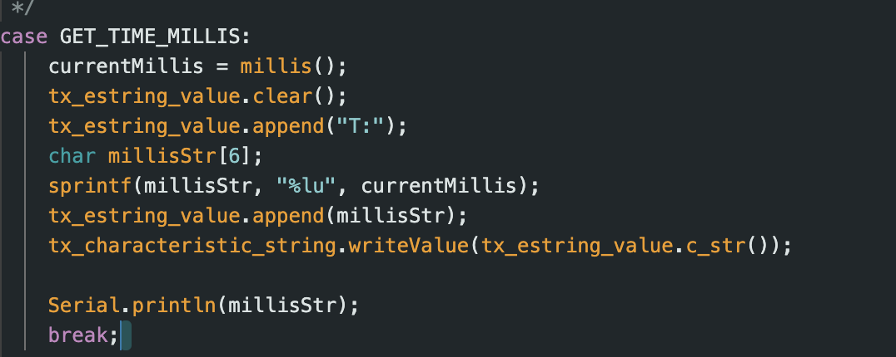

# Task 4
{: .fs-3 }

The next task was to implement a notification handler to handle recieving the time data, which allows the handling of the data to happen asynchronously. The code for this involved creating a global variable to store the string of the time. To create the notification handler, we first needed to create a callback function which has the parameters of the uuid of the BLE Characteristic which is the String Characteristic in this case as well as the name of the variable where the data is stored. After starting the notification handler with the UUID and callback function as parameters, we then print the milliseconds and finally stop the notifier. I used Nidhi Sonwalker's write-up as guidance on how to approach implementing the notification handler.
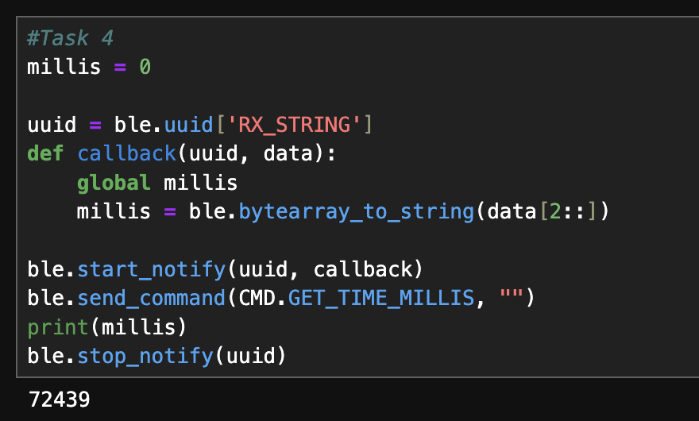

# Task 5
{: .fs-3 }

The fifth task implored us to find how fast messages could be sent between the laptop and Arduino. To do this, I created a new command "GET_MILLIS_ARRAY", which had a for loop that repeatedly sent millis data to the notification handler.
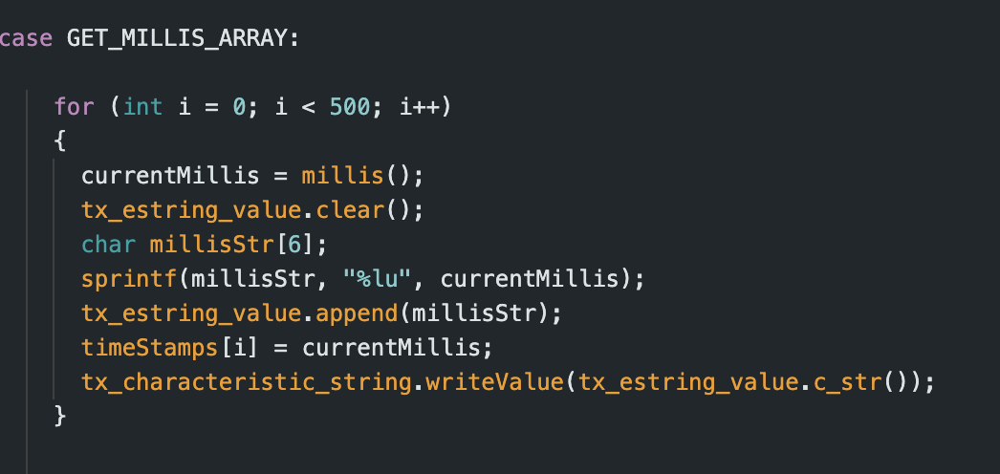

From the following runtime of this command, I found that the effective data transfer rate for this method was around 769 bytes per second.
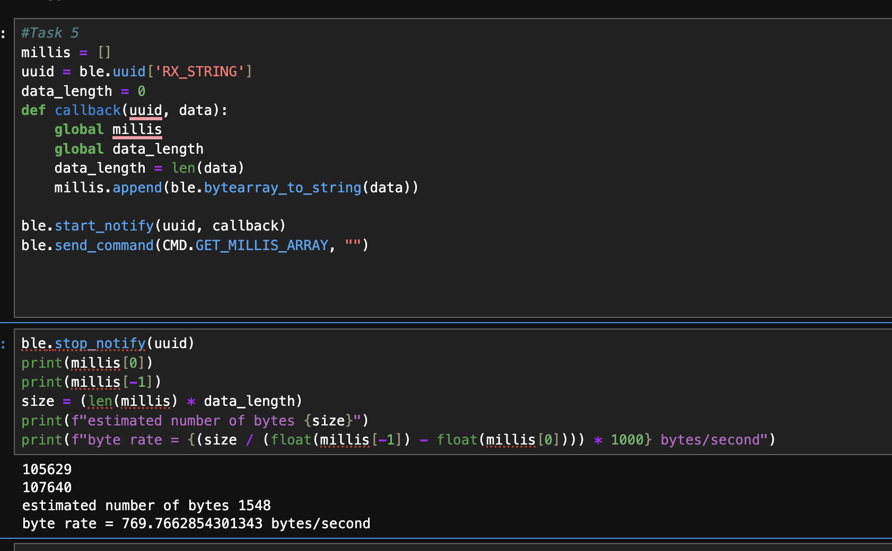

# Task 6
{: .fs-3 }

The sixth task assigned me with creating the command "SEND_TIME_DATA", which was another way of sending data from the Arduino to the laptop. Instead of finding the time and sending the data one by one, "SEND_TIME_DATA" first finds populates an array of 1000 with the time data, then after 1000 loops, sends the data in the array to the receiver.

The runtime shows that the effective data transfer rate is significantly greater at 310000 bytes/second.

# Task 7
{: .fs-3 }

Task 7 was very similar to Task 6 except we now include the temperature readings with the new command "GET_TEMP_READINGS", and we can get the temperature with the function call "getTempF". Now, we have two arrays, both with 1000 elements, storing the temperature at specific timestamps.

# Task 8
{: .fs-3 }

With the second method seen in Task 6, we see that are great advantage is that the data transfer rate in increased significantly as opposed to the method in Task 5 which is likely due to the fact that it doesn't have to access the sensor each time it sends data. However, since the data is only sent after its all been read, it may be the case that the data becomes outdated as opposed to the real time. This method also gives the option of storing the data for later purposes where the method in Task 5 immediately sends the data and overwrites it with new data, which may mean it's more up to date but also unable to reference later. With 384 kb of memory, which is 384000 bytes, in the case of String Characteristics, strings are usually 8 bytes of memory each, meaning that we could store a maximum of 48000 strings in RAM before running out.

# Conclusion
{: .fs-5 }

As a whole, in this lab I've learned more about how Bluetooth communications operate between a computer and an Arduino with the use of the BLE library. It has also given me some insight on the different options I can choose from for sending data from the Arduino to the computer either by reading sensor data and sending it off one by one or taking all the data first and then sending it over sequentially. 

