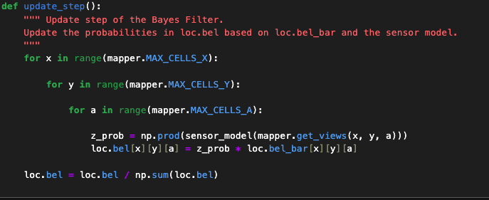

# Lab 10
{: .fs-9 }

The goal of this lab is to implement a Bayes Filter for localization in a simulator.

# Bayes Filter Overview
{: .fs-7 }

Bayes Filter is a localization algorithm that allows you to estimate the position of a robot on a map. It goes through two steps: prediction and update steps where the filter predicts the next position using the motion model and then updates the prediction based on the sensor model information. This allows the robot to have a high probabilility of knowing its current location within a map, however there is always uncertainty. One thing to note is that in the prediction step, the uncertainty in the model increases and in the update step, the uncertainty decreases. The pseudocode for the algorithm is below:

# Implementation
{: .fs-7 }

# Compute Control
{: .fs-5 }

The first function to implement was the compute control function, which calculated the actual control of the robot based on its current and previous position by taking the difference. This part is crucial for creating the motion model for the prediction step of the Bayes Filter. The implementation is found below:

# Odometry Motion Model
{: .fs-5 }

The next function is the actual odometry motion model, which uses the previous compute control function to find the actual control and then finds a gaussian for each of the dimensions, and then multiplies them all together to get the final motion model probability value. The implementation is found below:

# Prediction Step
{: .fs-5 }

The next function was the prediction step, which involved iterating through each grid element, then getting the prior belief and then using the motion model to predict the probability that it will reach any other grid element for each of those grid elements, which is then multiplied by the prior belief. One thing to note is that there is an optimization that if the belief is too low (<.0001) then it won't be calculated. The implementation is found below:

# Sensor Model
{: .fs-5 }

The next function is the sensor model that takes the gaussian for each of the 18 observations that the sensor in the simulator does. This will be used in the update step to reduce the uncertainty of the belief. The implementation is found below:

# Update Step
{: .fs-5 }

The update step function goes through each of the grid elements and for each of them it uses the product of the sensor model multiplied by the belief calculated in the prediction step to get the updated belief. Finally, it normalizes the probability distribution to make the sum equal to 1. The implementation is found below:

# Simulator
{: .fs-7 }

Below is a video of the simulator running with the Bayes Filter as well as the corresponding output of the Bayes Filter with the calculated beliefs. From the output, we can see that the model did a decent job of estimating the position of the robot in the map, but optimizations in the efficiency could be possible with matrix math or other of the suggested methods.

