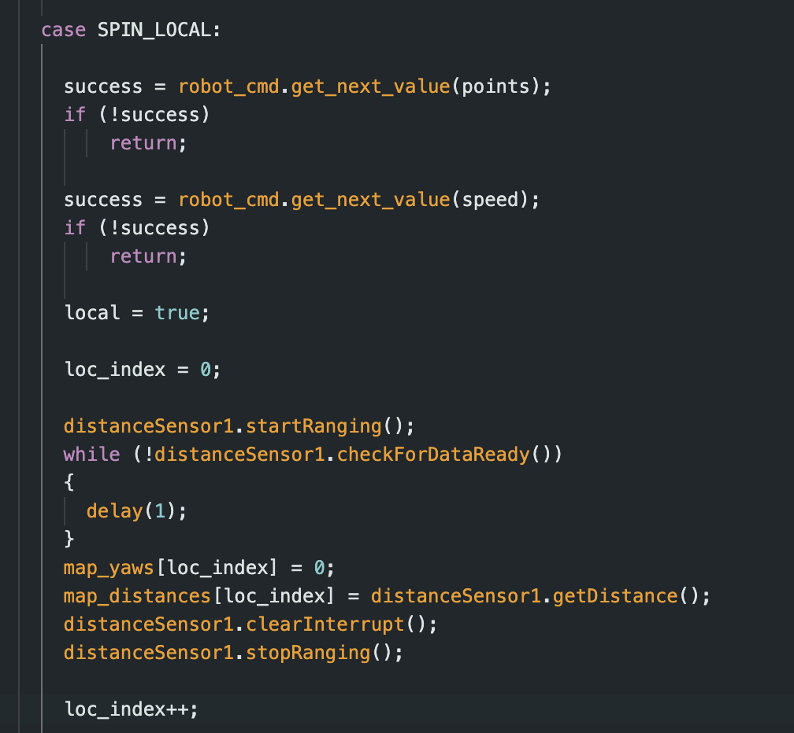

# Lab 11
{: .fs-9 }

The goal of this lab is to implement a Bayes Filter for localization on the actual robot.

# Bayes Filter Overview
{: .fs-7 }

Bayes Filter is a localization algorithm that allows you to estimate the position of a robot on a map. It goes through two steps: prediction and update steps where the filter predicts the next position using the motion model and then updates the prediction based on the sensor model information. This allows the robot to have a high probabilility of knowing its current location within a map, however there is always uncertainty. One thing to note is that in the prediction step, the uncertainty in the model increases and in the update step, the uncertainty decreases. The pseudocode for the algorithm is below:

# Simulation
{: .fs-7 }

Given the Lab 11 code, I needed to first test out the simulation to ensure that the Bayes filter was working properly. We can see that this is the case from the following image of the simulation running properly:

# Real
{: .fs-7 }

Following this, I needed to implement it so the Bayes Filter would work on the actual robot. To do this, I created the following command "SPIN_LOCAL". 

Then in the main loop, using the "local" boolean variable as the flag, I implemented the following in order to get the 18 TOF distance measurements as well as the corresponding yaw angles from the robot:

Finally, on the Python Jupyter notebook end, I implemented the "perform_observation_loop" method so that the Bayes filter can function properly and the laptop will be able to receieve the data from the robot.

# Results
{: .fs-7 }

Below are the results of running the Bayes Localization at the four different points:

# (5,3)
{: .fs-5 }

# (5,-3)
{: .fs-5 }

# (0,3)
{: .fs-5 }

# (-3,-2)
{: .fs-5 }

Overall, the results of the Bayes Localization is pretty poor, which could be a result of how the robot collects data, which might not align to how the Bayes Algorithm processes it. The point with the best localization was (5,3) likely cause it was in the most distinct location.