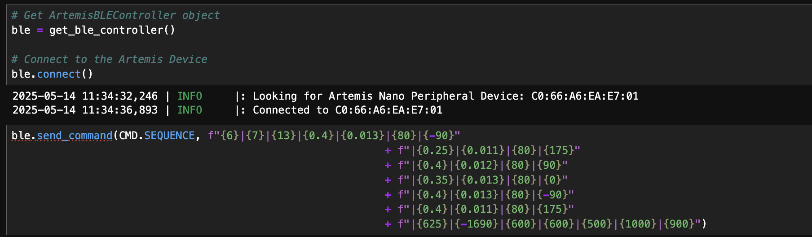

# Lab 12
{: .fs-9 }

The goal of this lab is to have the robot follow a path.

# Strategy
{: .fs-7 }

For my strategy for this lab, I decided on using PID/open loop paradigm where I have the position control open loop and based on the TOF sensor data, and the orientation control using a full PID controller and based on the DMP in the IMU. I then preplanned the path the robot needed to take manually based on the map and measurements given and fed it to the robot over bluetooth for ease of testing. The actual execution of the path and PID control/open loop control takes place on the Arduino on the robot. I decided to not do any localization and Bayes Filter for this lab as I didn't think it was necessary for completing the path and due to time constraints. 

# PID Orientation Control
{: .fs-7 }

I began with improving my orientation control. Back in lab 6, I only implemented a P controller, which worked fine, but I needed a PID controller to get the performance I needed. Below is the command I made for the PID control, which takes in the PID parameters and starts the flag in the main loop. 

Below is the code I implemented in the main loop to get my PID control working:

Below is the PID function I made for the orientation to calculate the control value for the PWM:

Below is the code I did to graph the yaw values for the PID and the bluetooth portion:

Below are the graphs and corresponding videos I made for the PID when moving to different angles (90, 180, -90) respectively:

# 90 degrees
{: .fs-3 }

# 180 degrees
{: .fs-3 }

# -90 degrees
{: .fs-3 }

We can see from this that the PID control works well at multiple angles and is ready to be incorporated into the path following protocol.

# Sequence 
{: .fs-7 }

After doing the PID orientation control, I found that open loop control for the position worked well if the PWM was at a low speed with the TOF indicating when to stop. I then needed to plan out the path for the robot to follow. Below is a diagram of the path I found for the robot to pass through all the points and would work with my protocol:

I then implemented the following command and main loop code in order to get the robot to be able to run sequences of movements from just one bluetooth command. The way that it works is that it first gets the number of rotations then the number of translations, after that for how many rotations you gave, it gets the PID values and setpoints for all the them, and then for all the translations it gets the setpoints for the TOF sensor. The way that it works in the main loop, is that it alternates between translations and rotations, which works fine in this case for this path. 

I then created the following ble command with the following setpoints and PID values:

# Results
{: .fs-7 }

The following videos are the best runs of my path, it's possible to get more consistent runs, however, I did not have enough time to completely tune every action in the sequence. Even still, the car was able to make it most of the way through.

# Discussion
{: .fs-7 }

Some issues I noticed with the path after tuning is that derivative kick from going to -180 to 180 on the DMP would cause a lot of issues, which I was didn't address due to time constraints, additionally I could have made the PID finish more robust by having to wait a few seconds before stopping as sometimes the PID would stop after moving past the setpoint and still count it. This is due to the frequency of the DMP, which meant that the Arduino would get the value after the car has moved past that angle. However, despite this, the car was fairly consistent when running the path, and was able to make it most of the way through.

# References
{: .fs-7 }

I mainly used TA Mikayla Lahr's Lab 12 for reference on what to do.

Thank you for a great semester!