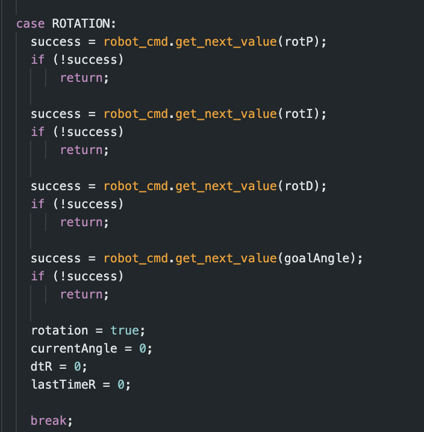
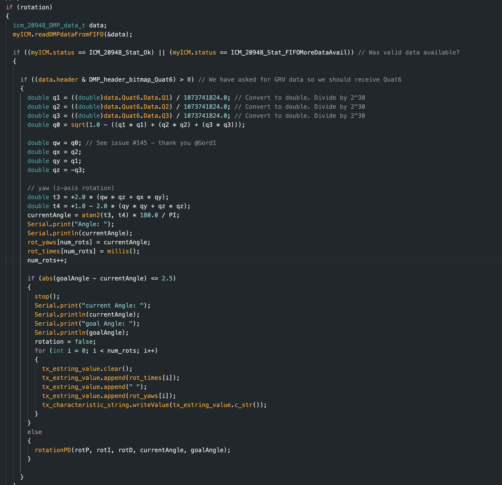
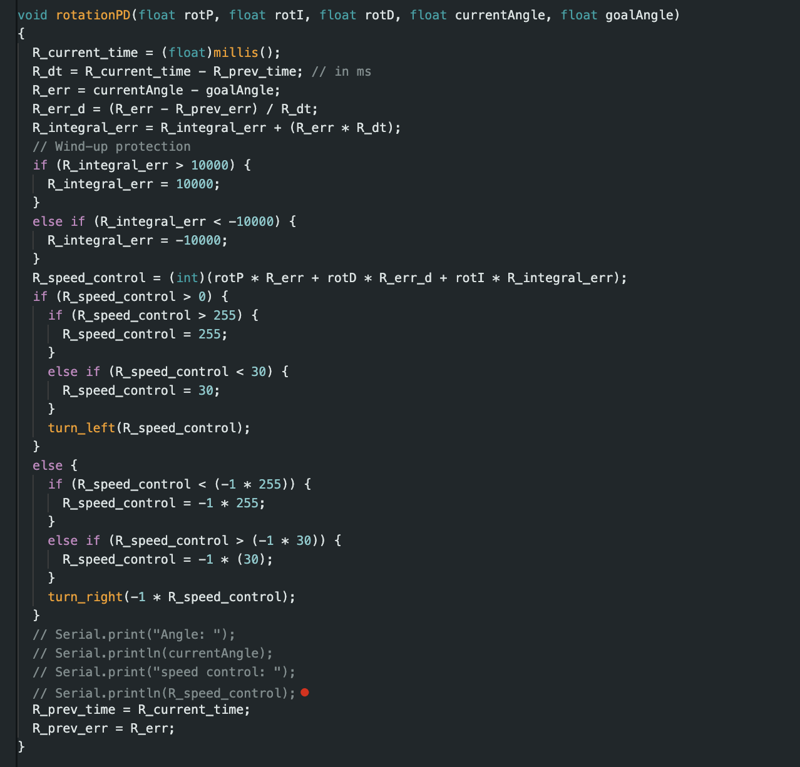
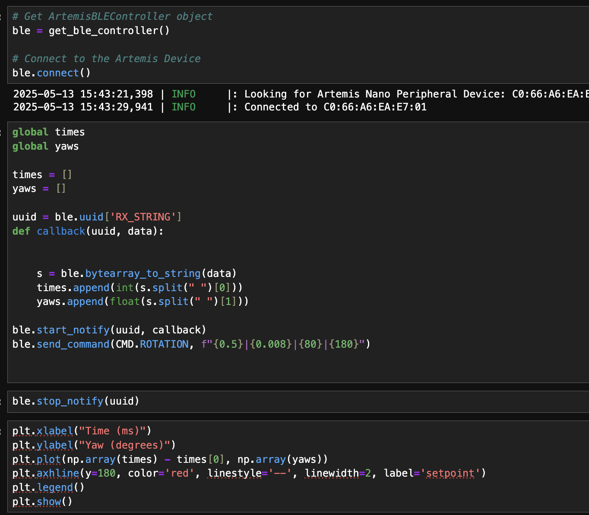
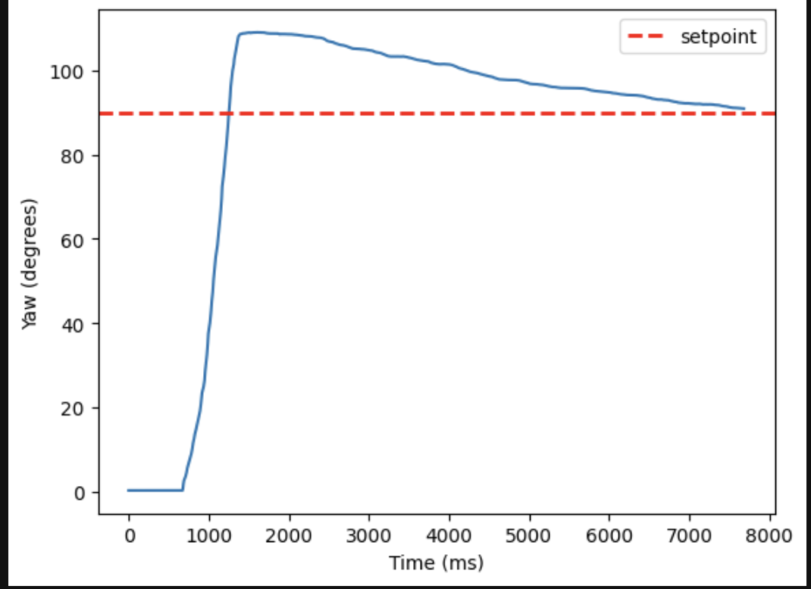
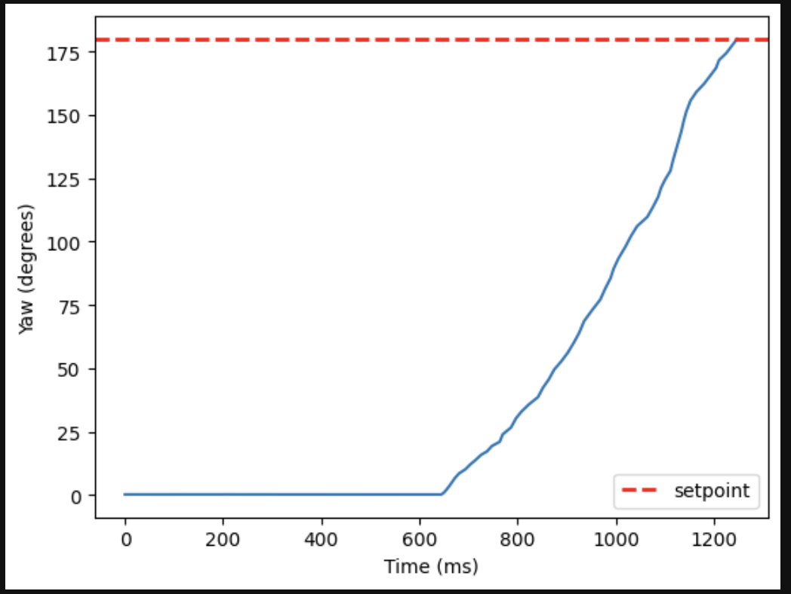
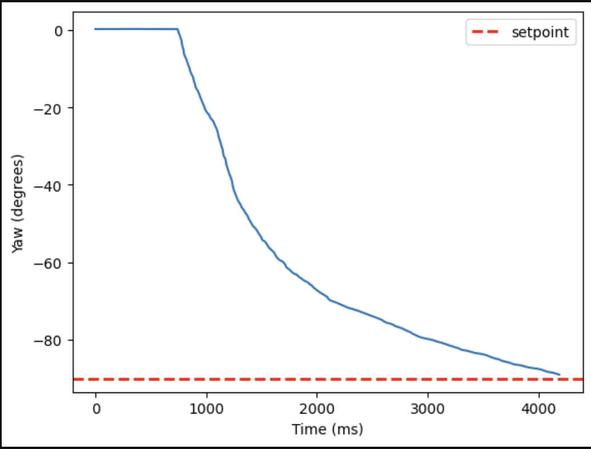
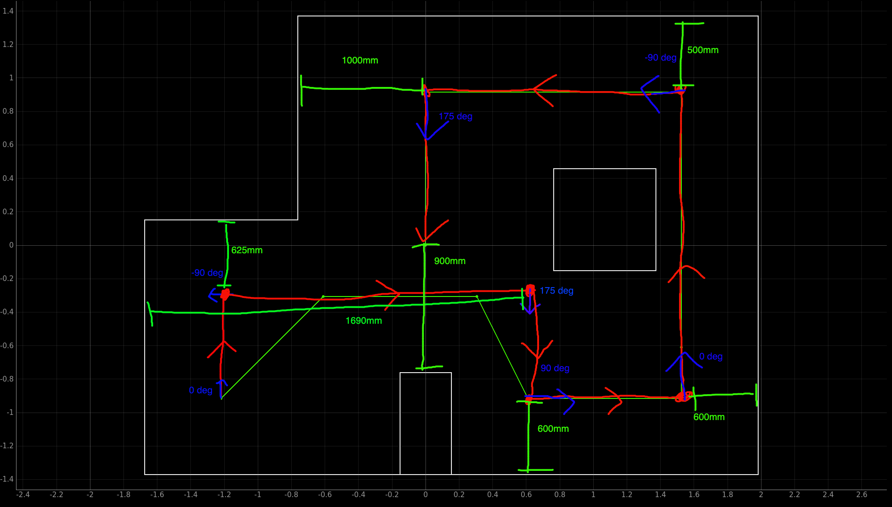

# Lab 12
{: .fs-9 }

The goal of this lab is to have the robot follow a path.

# Strategy
{: .fs-7 }

For my strategy for this lab, I decided on using PID/open loop paradigm where I have the position control open loop and based on the TOF sensor data, and the orientation control using a full PID controller and based on the DMP in the IMU. I then preplanned the path the robot needed to take manually based on the map and measurements given and fed it to the robot over bluetooth for ease of testing. The actual execution of the path and PID control/open loop control takes place on the Arduino on the robot. I decided to not do any localization and Bayes Filter for this lab as I didn't think it was necessary for completing the path and due to time constraints. 

# PID Orientation Control
{: .fs-7 }

I began with improving my orientation control. Back in lab 6, I only implemented a P controller, which worked fine, but I needed a PID controller to get the performance I needed. Below is the command I made for the PID control, which takes in the PID parameters and starts the flag in the main loop. 

Below is the code I implemented in the main loop to get my PID control working:

Below is the PID function I made for the orientation to calculate the control value for the PWM:

Below is the code I did to graph the yaw values for the PID and the bluetooth portion:

Below are the graphs I made for the PID when moving to different angles (90, 180, -90) respectively:

We can see from this that the PID control works well at multiple angles and is ready to be incorporated into the path following protocol.

# Sequence 
{: .fs-7 }

After doing the PID orientation control, I found that open loop control for the position worked well if the PWM was at a low speed with the TOF indicating when to stop. I then needed to plan out the path for the robot to follow. Below is a diagram of the path I found for the robot to pass through all the points and would work with my protocol:

# Results
{: .fs-7 }

