# Lab 3
{: .fs-9 }

The purpose of this lab is to get introduced to the two TOF sensors given in the kit as well as setting them up to be used in the car.

# Pre-Lab
{: .fs-7 }

# Sensor Address
{: .fs-5 }

According to the manual for this TOF sensor, it uses I2C in order to communicate with the Arduino. From this manual, we also find out that the default address for the TOF is 0x52 in hex.

# Two TOF Sensors
{: .fs-5 }

In this lab, we need to connect two TOF flight sensors, however since they both have the same I2C address, we can't just simply connect them. In order to have two TOF sensors functioning simultaneously, we need to make use of the XSHUT pin on the TOF board. By connecting this pin to a pin on the Arduino board, we are able to control when it shuts down in the code. We can use this to have it so that in the code we can shut down one of the TOF sensors, then change the address of the other sensor, and then turn the first sensor back on. By doing this, it will make it so that each sensor will have a different address, allowing us to use both of them.

# Placement
{: .fs-5 }

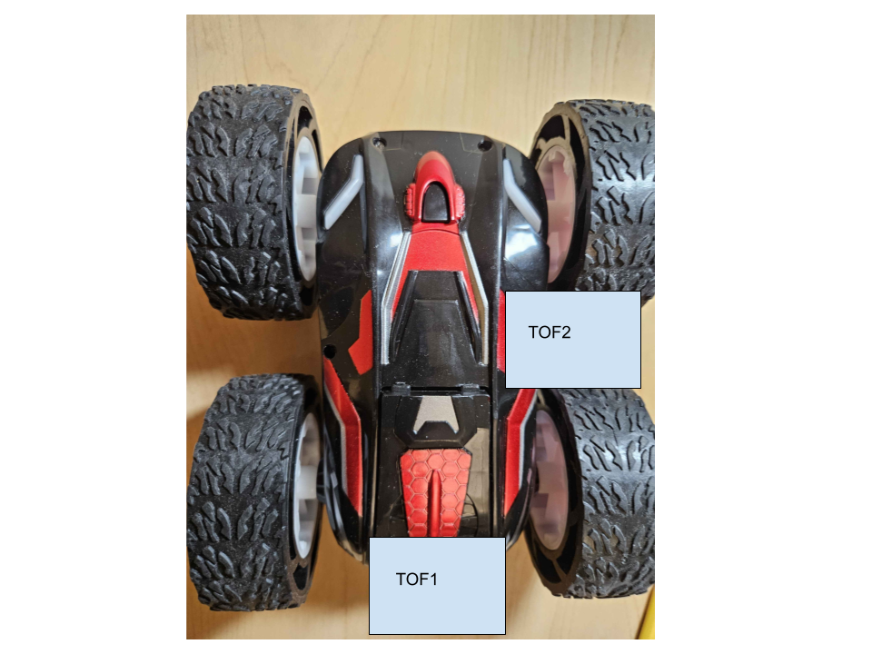

I've decided to put my sensors on the front of the car and on the left part of the car. This will allow me to sense obstacles from both the front and left side which will be useful later on. However, one disadvantage of this setup is that I am unable to check for obstacles if the car goes in reverse.

# Wiring
{: .fs-5 }

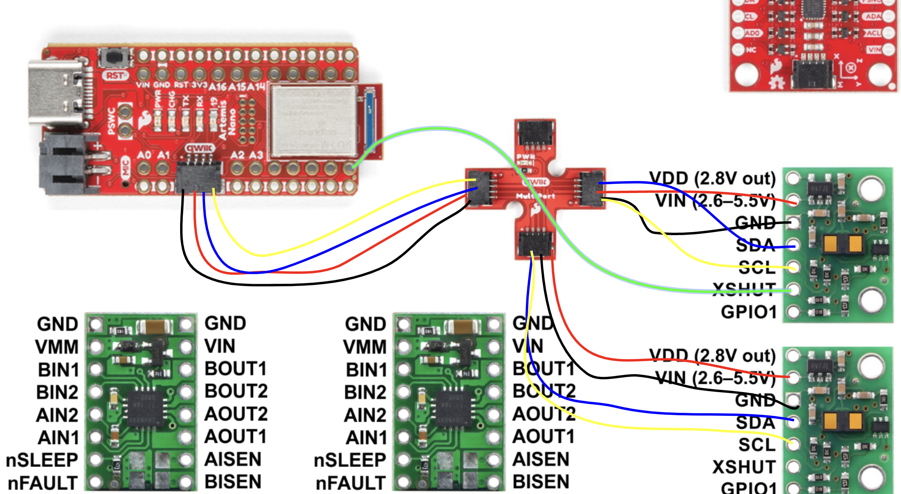

Above is the wiring diagram of my sensors and the Arduino IDE. Notice that the SDA pin goes with the blue wire and the SCL pin goes with the yellow wire. Additionally we see that the XSHUT pin on one of the TOF sensors is connected directly with pin 8 on the Arduino.

# Connecting Components
{: .fs-7 }

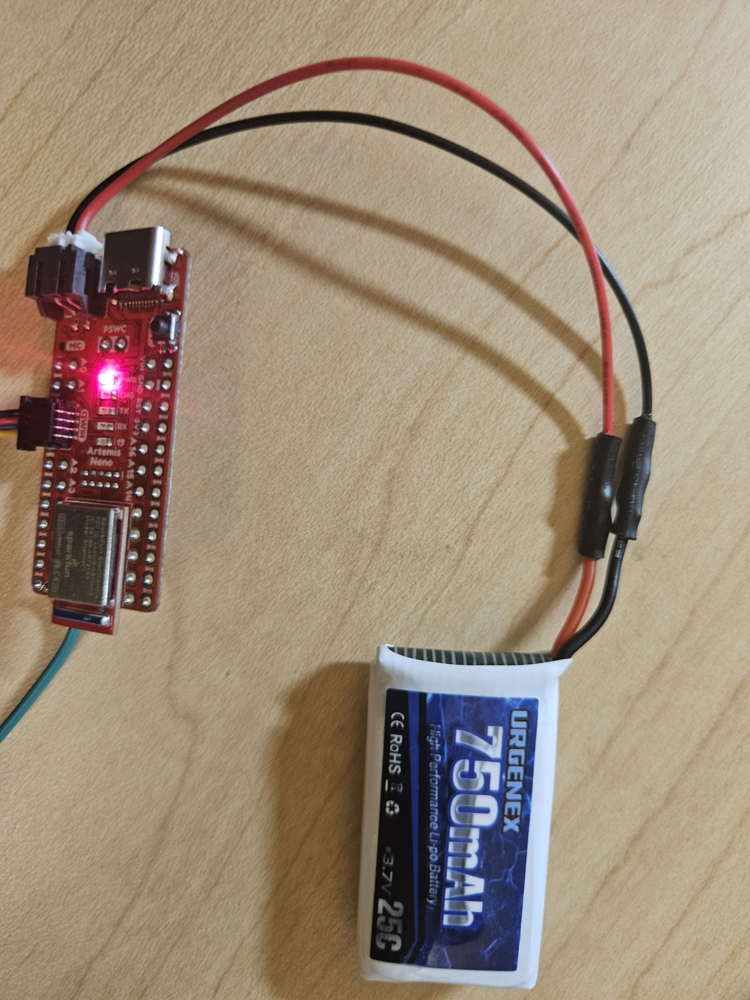

The first step I needed to do for this lab was to power the Arduino over battery rather than through the USB cable. I did this be sautering the red and black connector to the battery wires and plugging it into the Arduino, getting the picture above.

The above video shows that I am still able to connect to the Jupyter lab over bluetooth even when powered over battery.

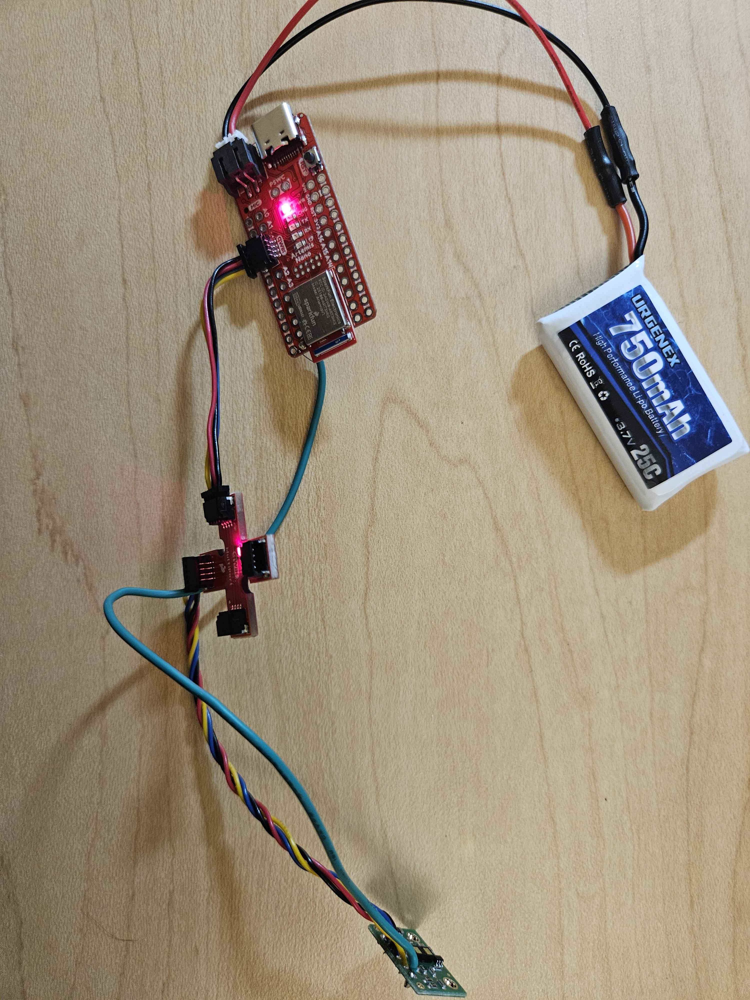

The above picture shows the wired connection between the TOF sensors and the Arduino board.

# I2C Scanning
{: .fs-7 }

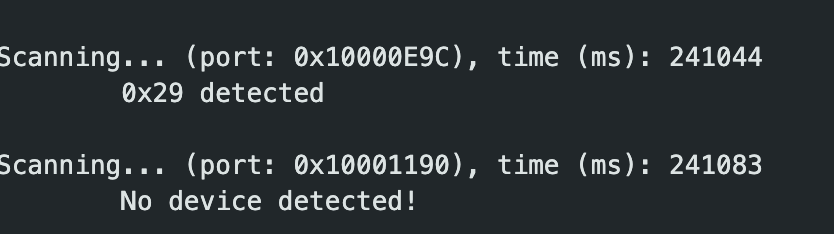

Using the example code for the I2C wire, we are able to see the address of the I2C connection. The above pictures shows what will be the serial output when only one TOF sensor is connected to the Arduino. The reason why the hex address says 0x29 when the default is 0x52 is because the LSB of the I2C address denotes read/write meaning that we have to shift the bits in 0x29 to the left by 1, which gets 0x52, the expected I2C address.

# Sensor Data for Chosen Mode
{: .fs-7 }

Between the three modes, long, medium, and short, the advantage of the short mode in the sensor is that there is less ambient interference or less noise due to the environmental light whereas the long sensor has more range. The middle range mode is a middle ground between the long and short modes.

I've decided to go with the short range sensors for now because I don't think that I'll need to sense obstacles more than 1.3m away from the car at this point.

With this chosen mode for the TOF sensor, I need to document the range, accuracy, repeatability, and ranging time:

# Range
{: .fs-5 }

In order to find the range of the sensor, I essentially found this out by moving the sensor away from the wall until it could no longer sense it. Below shows the code necessary to take in this data from the sensor.

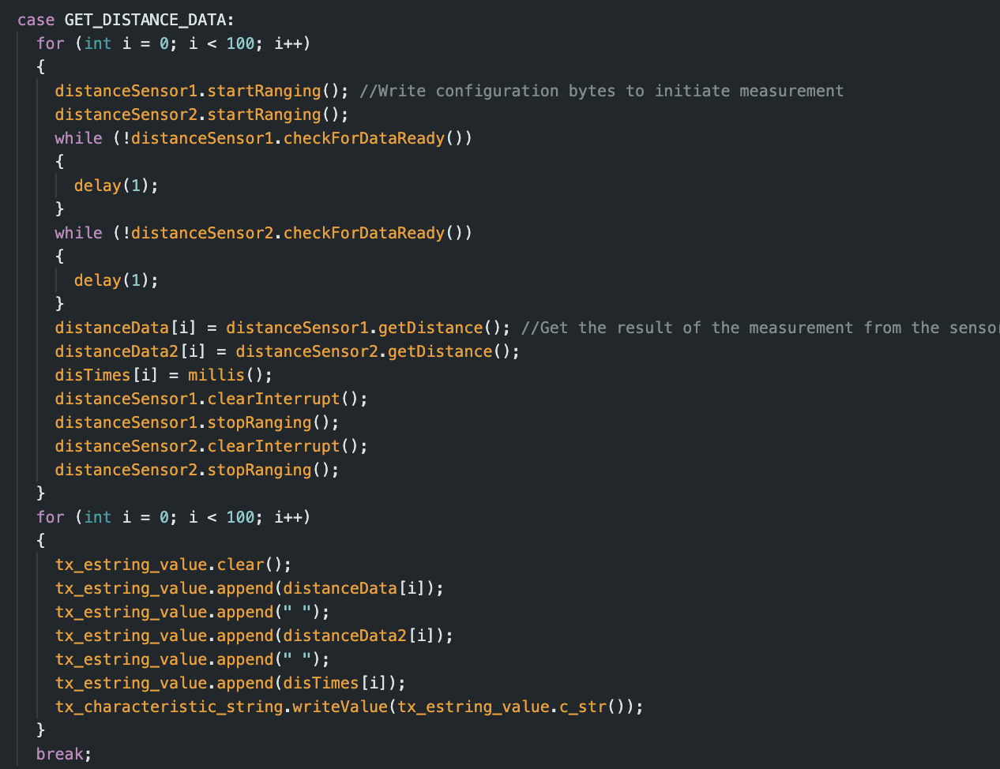

I used this code to plot the below diagram which shows the distance over time of the TOF sensor. We can see in the diagram that the short range mode of the sensor actually goes beyond the specified distance of 1.3 meters and up to around 2.1 meters before it is unable to sense the wall anymore.

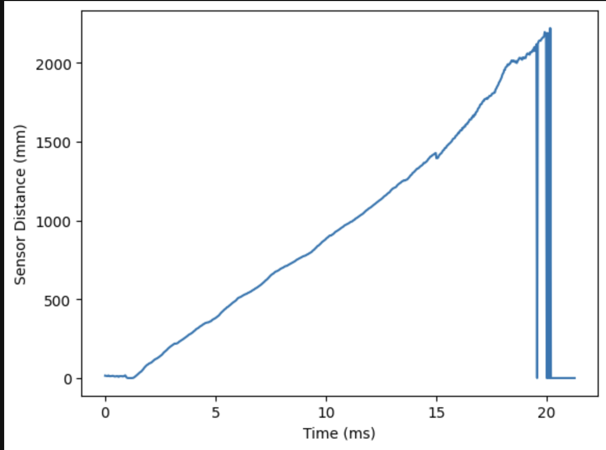

# Accuracy
{: .fs-5 }

In order to find the accuracy of this sensor, I measured known distances from the wall [0mm, 100mm, 200mm, 300mm, 400mm, 500mm] and used the TOF at each point to measure the error between the actual distance and the measured distance.

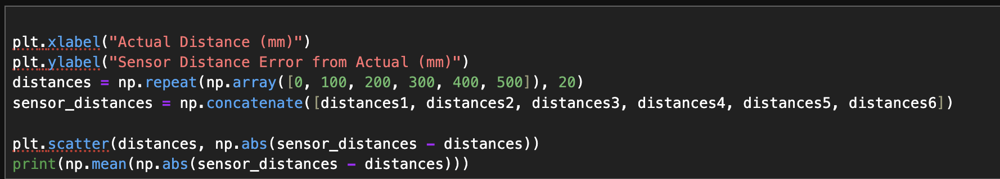

The above code shows the Jupyter lab code needed to plot the below diagram:

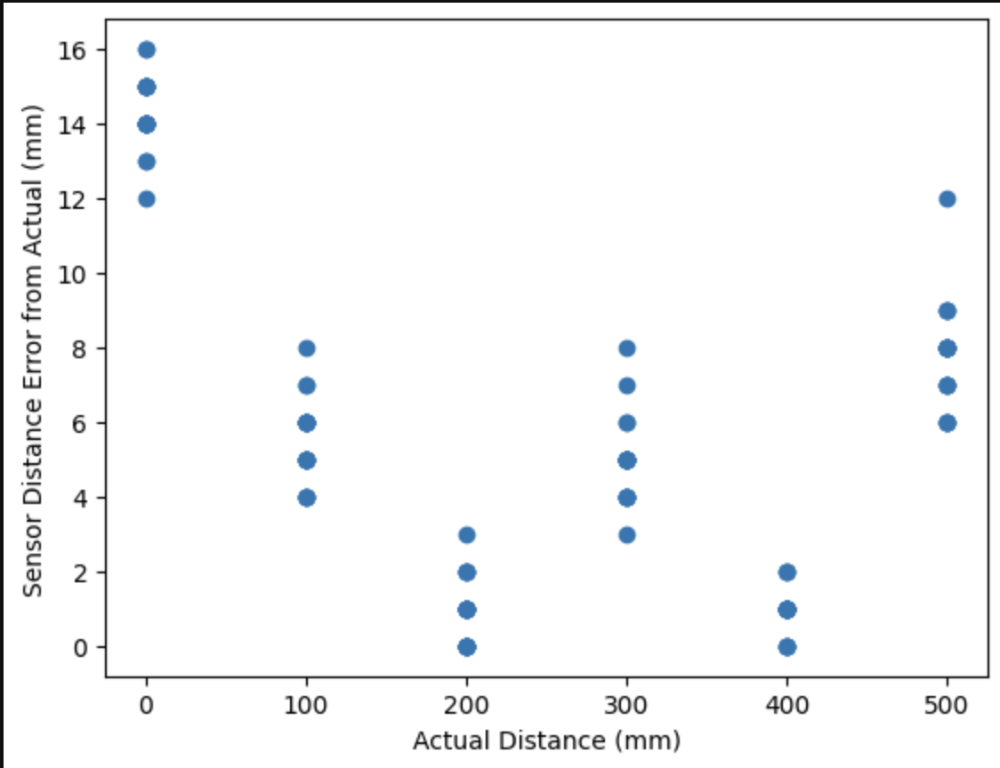

In this diagram we see that absolute difference between the measured distance and the actual difference is around 5.7 mm, which is pretty decent and is actually an overestimation. This is due to the fact that there were many possibilities for human error in measuring the distances at each set distance from the wall.

# Repeatability
{: .fs-5 }

To find the repeatable of the TOF sensor, I took 20 different measurements from the 200mm distance from the wall and plotted the frequency in a histogram. Below shows the code and plot:

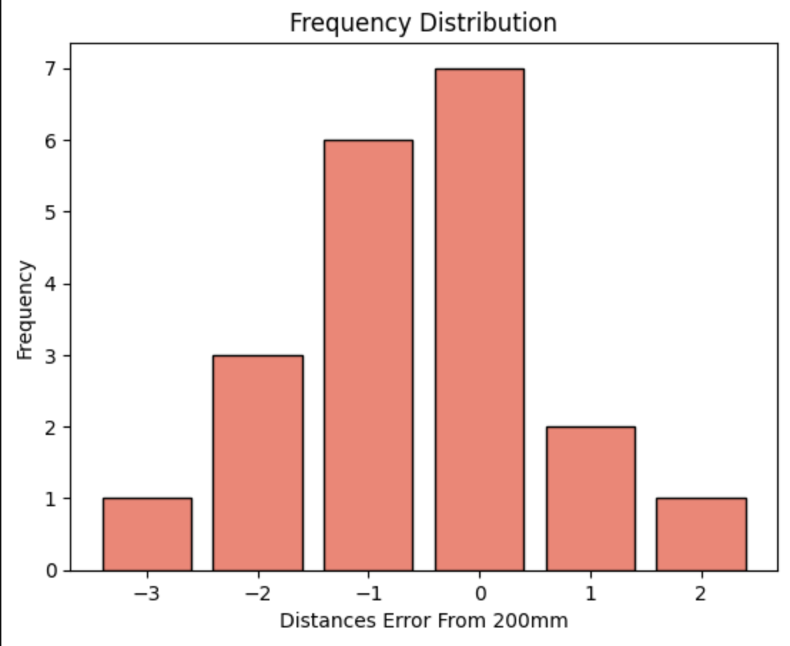

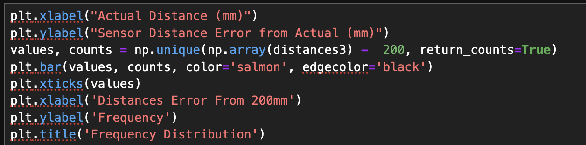

We see from the plot that for this actual distance of 200mm the measurement stays within 3mm of the actual distance over multiple measurements at the same point.

# Ranging Time
{: .fs-5 }

To find the ranging time, I took the average of the timestamps I got when measuring, which came out to be around 49.5 ms.

# 2 TOF Sensors Connection
{: .fs-7 }

Following that, I then connected the other TOF sensor to the Multiport and Arduino, which can be seen in the below image.

As I stated above, in order to connect the two TOF sensors, we need to have one of the sensors' XSHUT pin be connected to the Arduino board. Additionally, the below code shows how we are able to change the address of one of the sensors.

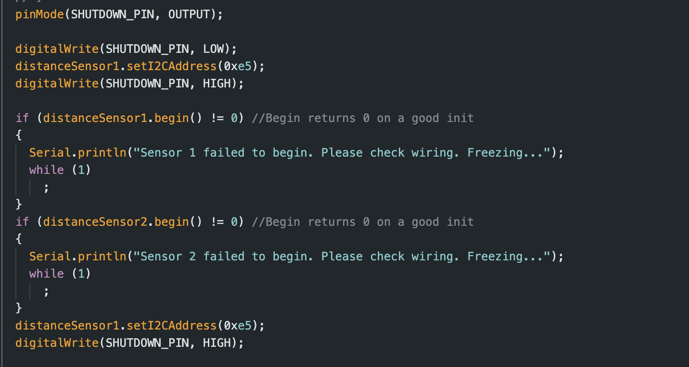

The following video shows the two TOF sensors working simultaneously:

# TOF sensor speed
{: .fs-7 }

In order to print the Artemis clock to the terminal as fast as possible as well as the sensor data when its ready I used the following code:

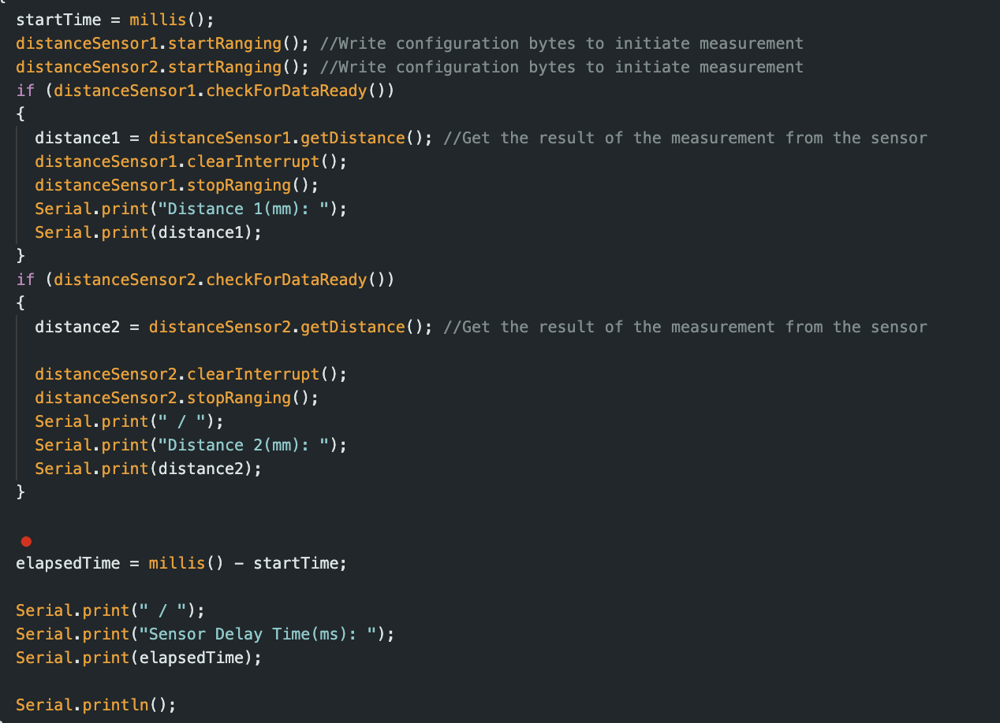

By wrapping the .checkForDataReady in an if statement, we are able to significantly increase the rate that the Arduino is outputting the Serial; additionally, we are now only printing when the data is ready.

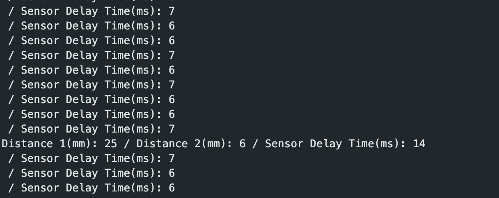

From the above picture of the Serial output, we are able to see that the code loop executes every 6-7 ms, with the TOF sensors going at a much slower rate. A possible limiting factor is that the TOF sensor data cannot read/write data that fast or it does not get it ready in time either.

# TOF and IMU Time Data
{: .fs-7 }

The last step in this lab was to plot the IMU and TOF data against time by combining it with the way we collecting data over bluetooth like in Lab 1.

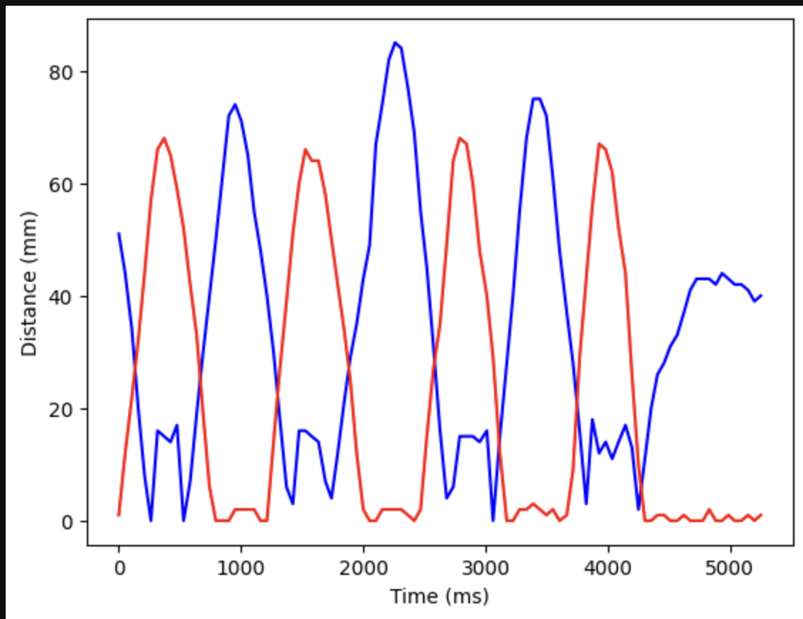

This first plot takes the distance in millimeters of the two TOF sensors and plots it against time.

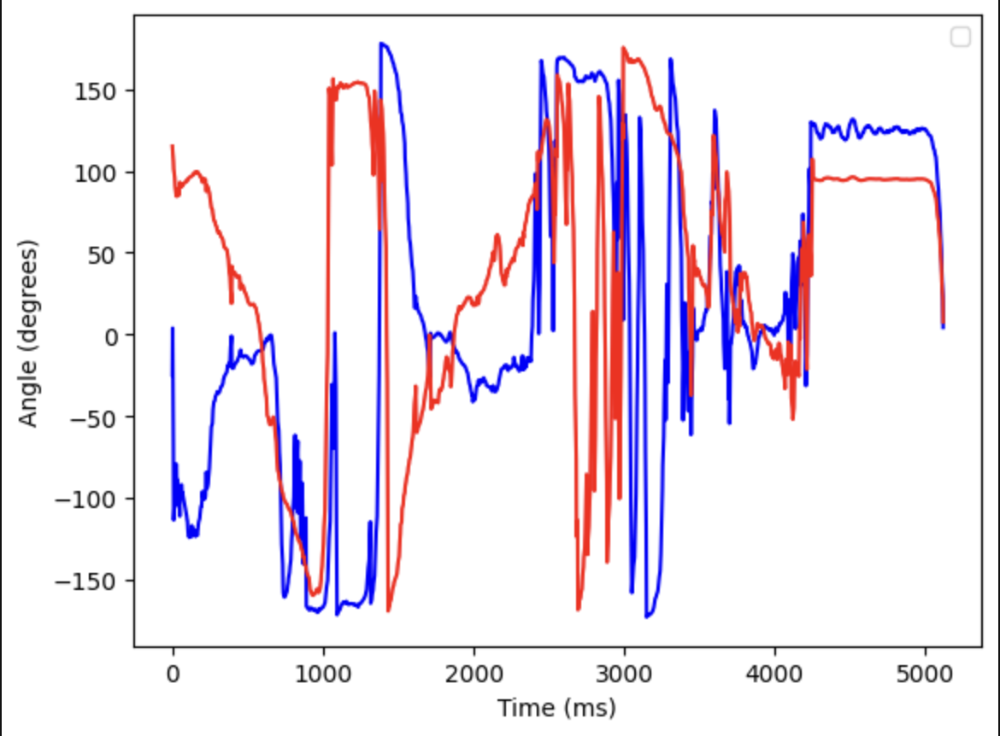

The next plot takes the calculated angle in degrees using the roll and pitch data from the accelerometer on the IMU like in Lab 2. The red line represents the roll data and the blue line represents the pitch data.
