# Lab 4
{: .fs-9 }

The purpose of this lab was to get introduced to the motor drivers and to finish wiring up the car.

# Pre-Lab
{: .fs-7 }

# Wiring Diagram
{: .fs-5 }

The first thing I had to do in this lab was wire up the motor drivers to the car. In order to see which pins on the Artemis I needed to use, I checked the pin functionality diagram on the Artemis and saw that pins 13, 14, 15, and 16 all allowed PWM. 

Regarding the batteries, it is better to power the Artemis and the motor drivers with separate batteries because they require different power needs and if they share the same battery the power given to the Artemis might be disrupted when the motors are being used.

I connected the motor drivers and Artemis together according to the following diagram below; I also made it so the inputs and outputs are hooked up in parallel.

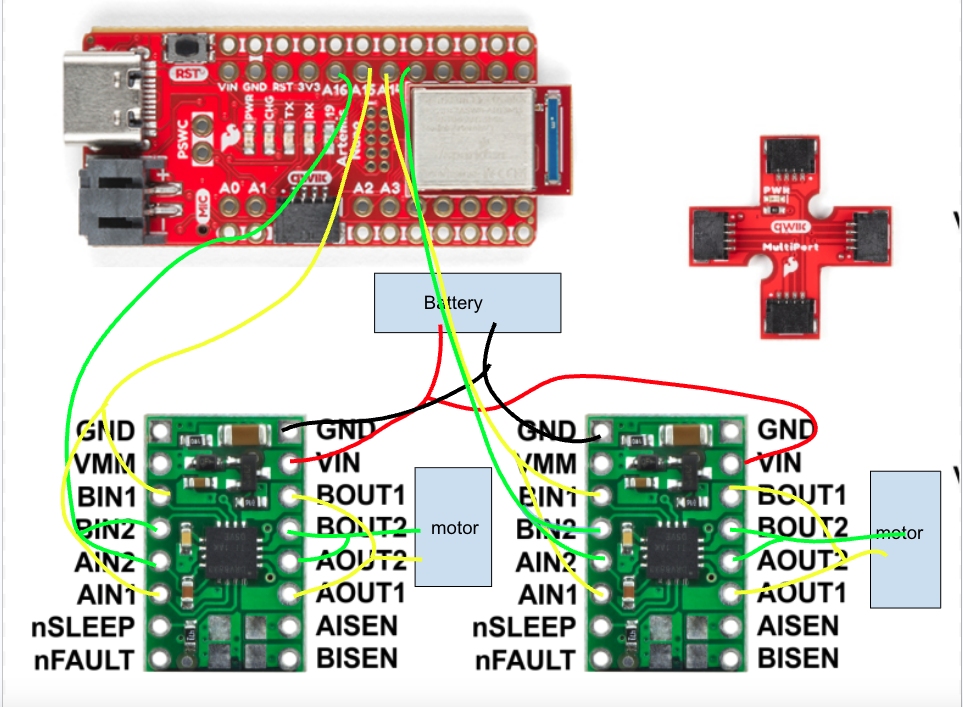

# Lab 4 Tasks
{: .fs-7 }

# Connecting First Motor Driver and Oscilloscope
{: .fs-7 }

First, I needed to connect one of the motor drivers and measure the PWM signal using the oscilloscope. To do this I soldered the IN pins in parallel and connected to their respective pins on the Artemis. After that, I soldered the OUT pins in parallel and connected them to the oscilloscope to be measured. 

Regarding the power supply, I found that in the datasheet for the motor driver, it has an operating range between 2.7 volts and 10.8 volts. In order to not overpower the motor driver with the power supply, I chose a relatively low voltage at around 3V, which should be sufficient for determining the PWM signal. Below you can see the power supply with the settings at 3V as well as the connections to the motor drivers and Artemis.

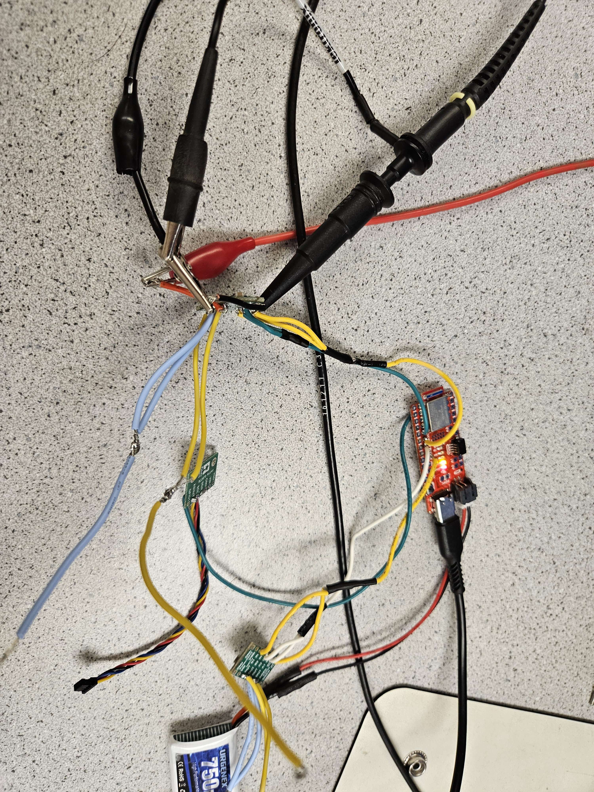

To test the output PWM signal from the motor driver, I used the analogWrite(PIN, num) function in the Arduino IDE to send signals from the OUT pins. In this function, the pin represents the number pin on the Artemis that we want to send the write the signal to and the num is a value from 0-255 corresponding to the duty cycle of the PWM signal. Below are the oscilloscope pictures and videos caused by both motor drivers as well as at different duty cycles.

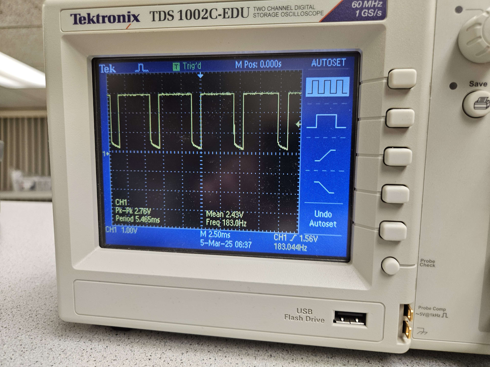

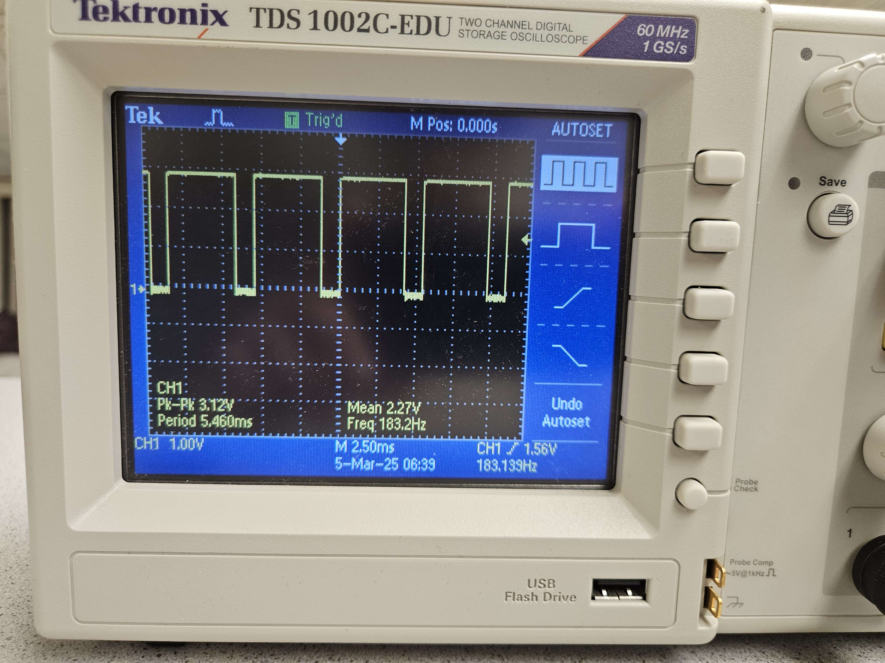

Below this is a code snippet of what I used to test the PWM output of the motor drivers. 

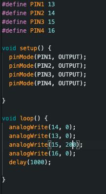

# Wheel Spinning
{: .fs-7 }

After ensuring with the oscilloscope that the motor drivers had the correct PWM signal output, I needed to connect the motor drivers with actual motors and test if the wheels spin. I first connected the OUT pins on the motor drivers that were previously connected to the oscilloscope to the motors but I left the power of the motor drivers still with the 3V power supply. Below are the videos showcasing the both sides of wheels spinning in both directions.

I used the following code in order to accomplish this and I isolated each side of the wheels by uncommenting and commenting different parts of the code in order to check both sides were running forwards and backwards properly.

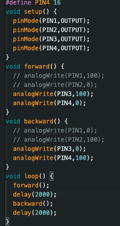

Following this, I needed to get the car to work with both motor drivers so that both sides of the car's wheels could spin together along with the motor drivers being connected with the 850mA battery rather than the 3V power supply. Below is a video of all the wheels spinning while the motor drivers are connected with the battery.

Below is the code I used for operating all four wheels.

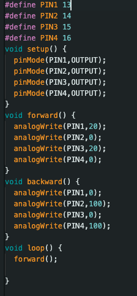

# Car Picture
{: .fs-7 }

Below is a diagram of the car with labeled components. After soldering everything to its respective places, I held down each of the components with double sided

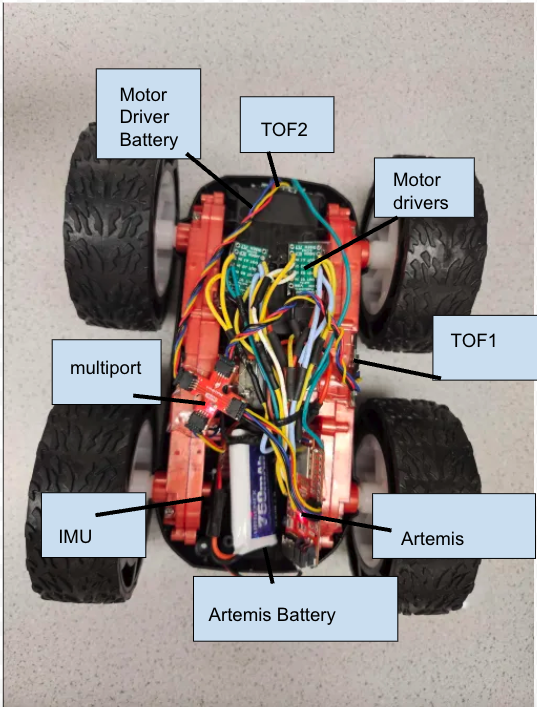

# Lower Limit PWM
{: .fs-7 }

After finishing up the car chassis and wiring all the components together. I needed to explore the lower limit of the PWM to find the threshold it takes for the car to move forward and turn. After some interation and testing using the following code, I found that the lower limit for moving forward was 30 in the analogWrite command. I did it using the following code:

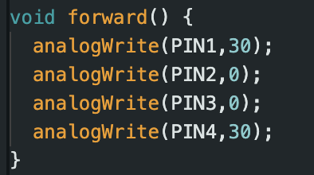

Below shows a video of the car moving at its slowest speed required to move on a flat surface.

For the lower PWM limit of the car when its turning, it was significantly higher at around 130 for the analogWrite command. This is likely due to the fact that there is now rotational friction that the car needs to overcome in order to starting turning. Below is the code I used.

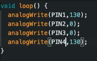

Below is a video of the car turning at its lowest possible PWM output.

# Motor Calibration
{: .fs-7 }

After that, I needed to find the calibration factor between the motors so that when the car runs, the car will not complemently veer off in a direction when its trying to move forward. Using the following code as a base, I tested different calibration factors until I was able to have the car move across the straight line while remaining on top as seen in the below video. In the code, I also included a timer so that the car started moving after 5 seconds to give me time to set it into position and it will run for 4 seconds, which was just enough time for the car to make it to the other side of the line. The motors were mostly aligned already only a calibration factor of 1.1 was needed in order for it to go straight.

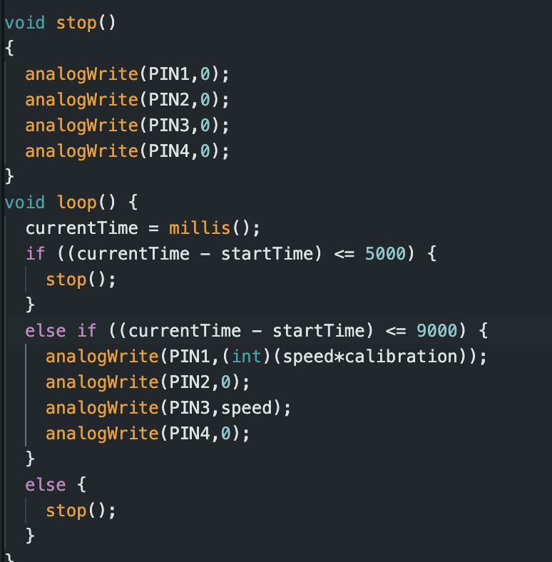

Here is the video of the car making it across the entire line.

# Open Loop Control
{: .fs-7 }

Finally, the last task I needed to complete for the lab was doing open loop control for the car that showed the car moving forward and turning. To accomplish this, I created multiple different functions that controlled the PWM output in order to go either forward, backward, left, or right. The code is below:

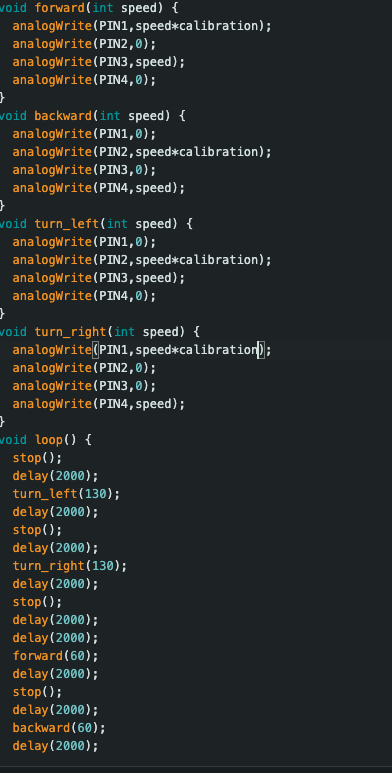

Below is a video of the car performing this open loop control sequence:

