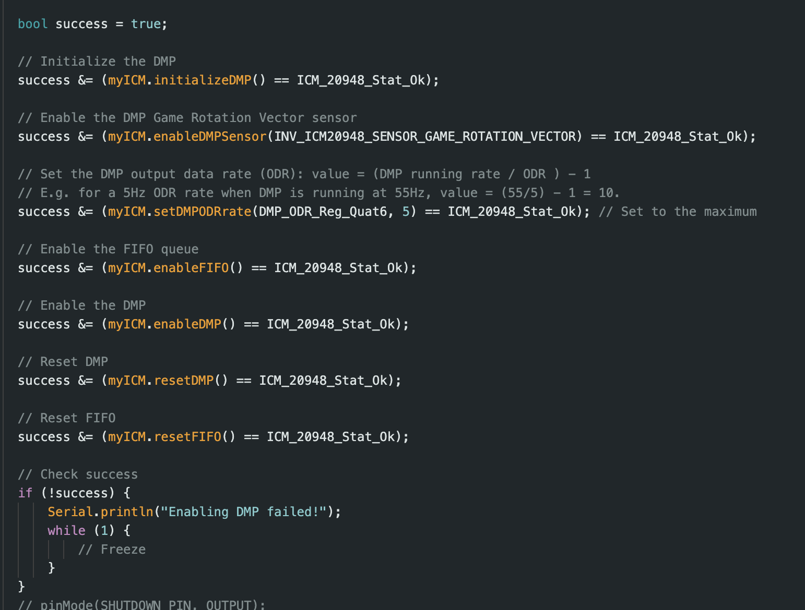

# Lab 6
{: .fs-9 }

The purpose of this lab was to implement rotational PID control for the car moving to a certain angle.

# Pre-Lab
{: .fs-7 }

# Bluetooth
{: .fs-5 }
As opposed to Lab 5, where I had all my bluetooth code in one command. I needed to have it so I'm able to change the setpoint while the program is still running rather than at the beginning. To do this, I first made it so the pid controller ran from the main loop in the Arduino code rather than in a specific command. You can see this in the code below:

Regarding the commands, I split them into "PID_ROTATION_CONTROLLER" and "PID_START":

"PID_ROTATION_CONTROLLER" is responsible for taking in the PID gains and setpoint angle from the Jupyter notebook so that they can be used in the control loop. Below is the code for this command.

"PID_START" is responsible for setting the flag which allows the control loop to start running and the data to start getting recorded. It also resets all the values and arrays to zero. Below is the code for this command.

On the Jupyter notebook side of the bluetooth communication, it's very similar to what I did in the previous labs except that the notification handler and bluetooth commands are now decoupled. Below is the code for receiving the bluetooth data as well as how I graphed it.

# Lab Tasks
{: .fs-7 }

# DMP
{: .fs-5 }

In order to avoid problems that we get by directly using the gyroscope like the drift caused as a result of digital integration, I ended up using the DMP onboard the IMU, which automatically handles error and drift correction. I used Stephen Wagner's guide in order to implement this part. 

Within my code, in the setup function, I set up the DMP in the following way, which is exactly how Stephen sets it up in his guide:

I then used a separate function to get the values from the IMU and calculate the yaw using the quaternions from the DMP, which can be seen below.

I then call this method in the main loop so that the value can be updated every loop if the data is available from the queue.

# Range and Sampling Discussion
{: .fs-5 }

For the sampling rate of the DMP, I put in an ODR of 5, meaning that the sampling rate should be around 10 Hz. From the data, we get that the sampling rate is around 6.5Hz, which was calculated in the below manner:

# P/I/D Discussion
{: .fs-5 }

Of the different controllers in this Lab to choose from, I decided to go with a P controller for ease of implementation, mainly because I was having difficulties with getting the full PID to work. 

Given a simple PD controller, the equation for the motor output will be as follows:

speed = kP * error + kD * d_error

The proportional gain kP adjusts the current error or the difference between the setpoint and current distance value in proportion to its magnitude. A higher kP value would be a larger error correction, which may lead to overshooting. However, a kP value that is too small would lead to the car stopping before it reached the setpoint.

The derivative gain kD predicts future errors by looking at the rate of change of the error. The purpose of this gain is to dampen in order to minimize overshooting a control the speed of the corrected action from the other gains, however, it is more susceptible to sudden changes like noise.

# P Controller
{: .fs-5 }

The range of motor values is from 140 to 255, where 140 is the minimum PWM output to cause the car to move linearly on the floor and 255 is the maxmimum PWM value.

I first started with implementing a P controller in a very similar manner in which I did in the previous lab except instead of going forward and backwards, the car will now go left and right. We can see this with the below implementation.

In the video below, you can see an example of the car turning to the setpoint as well as how it responds to a change in orientation after already reaching the setpoint. The P gain used to get this video was 0.7.

Below is a graph of the P controller with its measured yaw against time:

