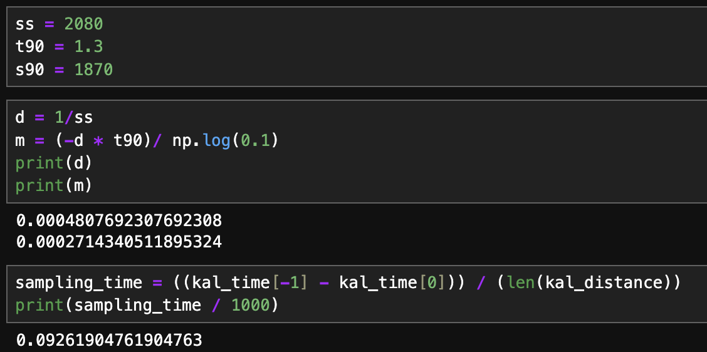
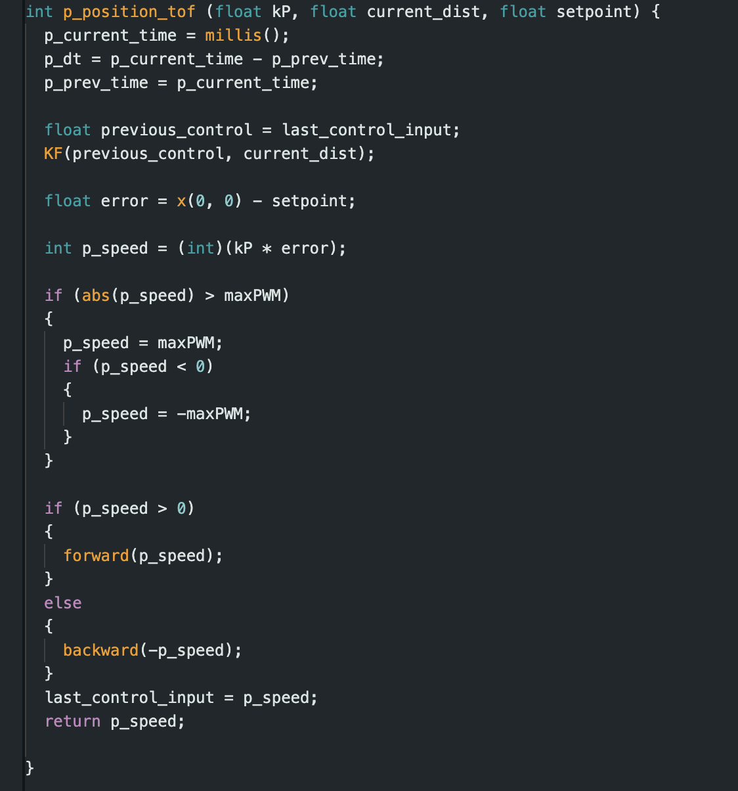

# Lab 7
{: .fs-9 }

The purpose of this lab was to implement a Kalman filter both in simulation through pre-recorded data and on the robot.

# Estimate drag and momentum
{: .fs-7 }

The first thing I needed to do in the lab was build a state space model for the system. We are able to do this by driving the car towards a wall at constant speed and then breaking the car. This was implemented on the robot and in the Jupyter notebook to send the TOF sensor data in the following way:

By doing this I was able to send the TOF sensor data over bluetooth so I could analyze it and simulate Kalman filtering in the Python notebook. Below are the graphs of the distance, speed, and PWM, data from running the car at constant speed into the wall.

After this I estimated the steady-state speed, 90% rise time, and 90% rise speed and got the below values. I then used them to calculate d and m according to the formula given in lecture. The sampling time of the TOF sensor was also found, which was sampled around every 0.09 seconds.

# Initialize KF

After this, I calculated my A and B matrices and then discretized them according the formulas given in lecture:

Similarly, I also calculated the C matrix using the method given in lecture as well as the x matrix.

Following that, I needed to estimate the covariance matrices to determine how much trust would go into our sensors or the motion model. I began with the following covariance matrices, which will be tuned later on. For the control covariance, I made it dependent on the dt, similar to the lecture, and for the sensor covariance matrix, I made it relatively lower because I wanted to give more trust in the sensor model.

# Implement Kalman Filter

The following is my Kalman filter code that I implemented in Python:

After plotting the Kalman filtered TOF data compared to the raw TOF data, I got the following graph:

As you can see from the above graph, the Kalman filter data is slightly off. Because off this, I went back and modified by Kalman filter parameters to have a larger number in the covariance matrix for the control, meaning that I will place less trust in that part. Below is the graph and code after changing that covariance matrix.

The results from the above graph are slightly better, but could still be improved. I then modified to Kalman filter parameters to lower the relative value of the sensor covariance matrix, so that even more trust and less noise is added.

Now the graph pretty closely follows the sensor values. 

Overall, the four Kalman filter parameters are the control covariance matrix sig_u, the sensor covariance matrix sig_z, the initial condition sigma, and initial condition x.

By decreasing either the control or the sensor covariance matrices, you can increase your trust the Kalman filter has in them, or vice versa in order to decrease the trust.

For the initial condition sigma, it affects how sensitive the filter is initially to noise in the environment, by increasing it, you can make it more sensitive, and decrease it to make it less sensitive.

The initial condition x, is the starting position of the robot in the Kalman filter.

# Implement the Kalman Filter on the Robot

I first tried to implement the Kalman filter on the robot in the following way:

