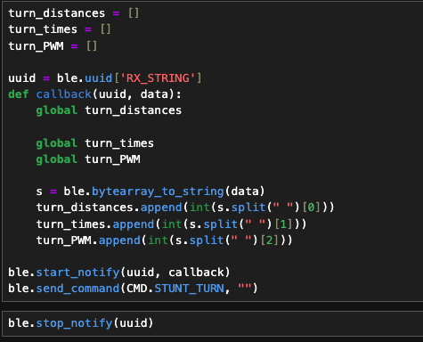

# Lab 8
{: .fs-9 }

The purpose of this lab was to implement either the drift stunt or the flip stunt onto the robot. I chose to do the drift stunt.

# Drift Implementation
{: .fs-7 }

I implemented the drift stunt using the following below command, which uses open loop instead of any sort of closed loop control, however, I was still able to achieve satisfactory results with just open loop:

After collecting the data within the previous steps I then sent to data over bluetooth using the BLE string characteristic within the same command. The code is below:

On the Jupyter Notebook side, I used a notification handler and send command similar to previous labs, and the code can be found in the below image:

Below are the videos of my car performing the stunts three separate times:

The following are the corresponding graphs associated with the videos. Additionally, since I used open loop PWM control, the PWM inputs are going to the be the same graph for all three videos.

