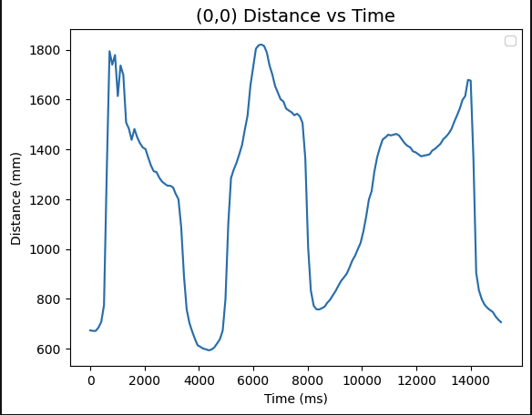
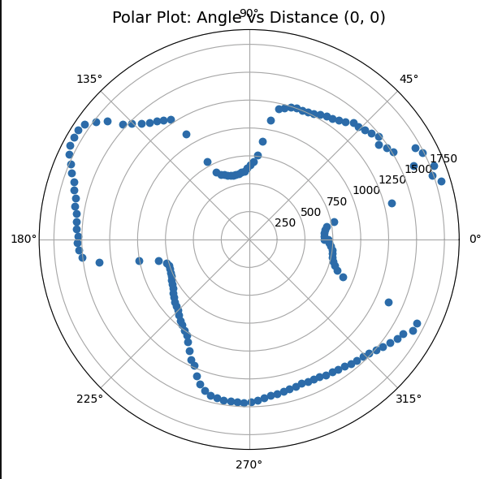
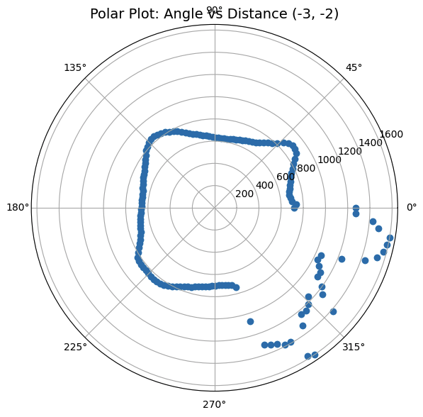

# Lab 9
{: .fs-9 }

The purpose of this lab was to map the layout of a static room and graph it on a plot.

# Control
{: .fs-7 }

I decided to go with open loop control to get the mapping data for simplicity and ease of implementation. Below, you can see the command I implemented for the Arduino "SPIN_MAP", which uses open loop orientation control to turn a little bit, then retrieve TOF data, and repeat for how many samples the command is given.

On the bluetooth end, the retrieving data is very similar to what I've done on previous labs with the notification handler and send_command. One thing to note is that retrieved 100+ data points, meaning that the resolution of the data is very high, however it may lead to more possible errors in the sensor data. Below you can see the implementation of this:

# Measure
{: .fs-7 }

The process I did to sample the TOF mapping data is that for each of the 5 points on the field, I measured at that point 2-3 times in order to reduce the uncertainty due to the open loop control and differences in angle measurements. One issue I noticed while gathering data is that the rotation of the car changed every time I reran the car to retrieve data; this is likely due to the ground friction as well as the battery levels, which is why I measured each point multiple times in order to mitigate this uncertainty. Below are the graphs of the TOF data vs time as well as a video demonstration of the car getting data:

# Polar
{: .fs-7 }

I then converted the data into polar graphs through the following code. One thing to note is that I estimated the theta angle with numpy linspace with a uniform distribution of thetas rather than using the IMU since with my measurement I tried to get a 360 degrees rotation starting at 0 and ending at 360 with the TOF sensor sampling at every time step.

Below are the converted polar graphs. One thing to note is that since I sampled my data CW instead of CCW, the data points are in the opposite direction of what they are supposed to be. I fix this in the transformation matrix step.

# Global Frame
{: .fs-7 }

In order to convert this matrix from polar coordinates into the cartesian global frame, we need to transform the distance and angle. One thing to note is that I added a small offset for the front TOF sensor of 40mm to account for the difference between the location where its recording data and the center of the robot on the field.

The output matrix is 2x1 with [x;y] and input is also 2x1 but with [theta;r]. In order to transform the polar vector into cartesian we first apply a scaling factor to convert the distances into feet. Then a rotation of cos(theta) in the x and sin(theta) in the y direction is applied. Finally, a translation of the location of the point is applied to get it from the robot frame to the global frame. Below is the code I used to compute the cartesian coordinates, which simplifies the matrix math into two statements.

The resulting graphs from this transformation are the following. One thing to note is that for the (0, 3) point, I added an additional pi/8 offset in order to align it better with the rest of the plots:

After combining the plots together, we get the following graph. One issue with this is that there are many points in the center of the graph which do not correspond to any obstacles. This could be the result of sensor errors, drift due to the open loop control, multiple people measuring at the same time, etc. However, we can still make out a decent map by using the denser regions of the plotted data.

We then put the lines on the graph to get the following figure. The plot is decent, however has many cases of measuring drift and points where there should not be. This could be improved through using PID control, which gives us more certainty in what we are measuring.

